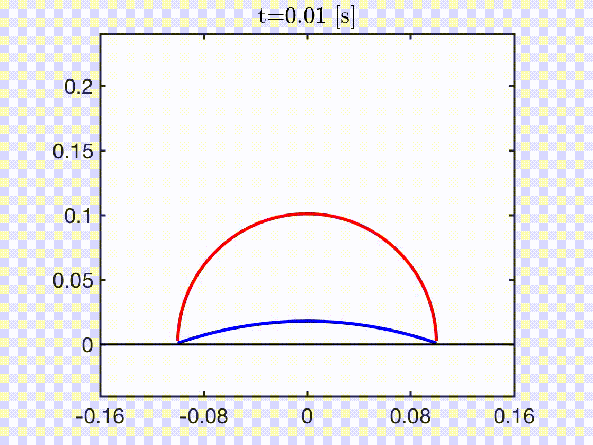

# Overview
This project involves a dynamic simulation of an axisymmetric shell jumper.

 

# Make 
g++ -I /usr/local/include/eigen-3.4.0/ main.cpp world.cpp setInput.cpp timeStepper.cpp inertialForce.cpp externalGravityForce.cpp dampingForce.cpp elasticStretchingForce.cpp elasticBendingForce.cpp elasticPlate.cpp externalPressureForce.cpp elasticBoundaryForce.cpp externalContactForce.cpp -lGL -lglut -lGLU -L${MKLROOT}/lib/intel64 -Wl,--no-as-needed -lmkl_intel_lp64 -lmkl_intel_thread -lmkl_core -liomp5 -llapack -lgfortran -fopenmp -lpthread -lm -Ofast -o simDER

# Run 
./simDER option.txt
